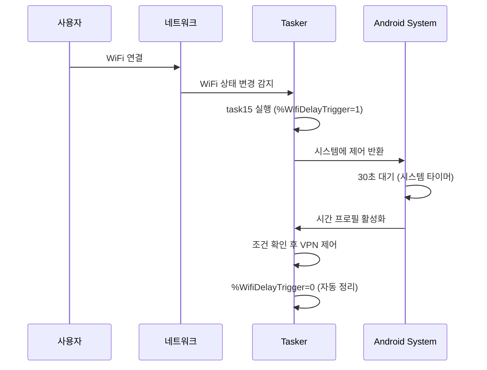

# 배터리 효율성 개선

## 변경사항 개요

Wait 액션을 시간 기반 프로필로 대체하여 배터리 효율성을 크게 개선했습니다.

## 이전 방식 vs 개선된 방식

### ❌ 이전 방식 (Wait 액션)
```
네트워크 변경 → 태스크 실행 → 30초 Wait → 조건 확인 → VPN 제어
```

**문제점:**
- Wait 동안 Tasker가 활성 상태로 대기 (배터리 소모)
- 메모리와 CPU 리소스 지속적 점유
- 네트워크 상태가 불안정할 때 즉시 실행되어 잘못된 조건 확인

### ✅ 개선된 방식 (시간 기반 프로필)
```
네트워크 변경 → 트리거 변수 설정 → 30초 후 시간 프로필 활성화 → 조건 확인 → VPN 제어
```

**장점:**
- Wait 액션 없이 시스템 기반 타이머 사용
- 배터리 소모 최소화
- 메모리 효율성 향상
- 네트워크 안정화 시간 확보

## 새로운 프로필 구조

### 1. 즉시 실행 프로필
- **Wifi Network (prof10)**: WiFi 연결 시 트리거 변수 설정 태스크 실행
- **Mobile Network (prof11)**: 모바일 네트워크 연결 시 트리거 변수 설정 태스크 실행

### 2. 지연 실행 프로필  
- **Wifi Network Delayed (prof15)**: 30초 후 + 트리거 변수 활성화 시 Tailscale Switch 실행
- **Mobile Network Delayed (prof16)**: 30초 후 + 트리거 변수 활성화 시 Tailscale OFF 실행

### 3. 트리거 태스크
- **Set Wifi Delay Trigger (task15)**: 
  1. %WifiDelayTrigger = 1 설정
  2. 31초 대기 (시간 프로필보다 1초 길게)
  3. %WifiDelayTrigger = 0 설정 (자동 정리)

- **Set Mobile Delay Trigger (task16)**:
  1. %MobileDelayTrigger = 1 설정
  2. 31초 대기
  3. %MobileDelayTrigger = 0 설정

## 배터리 효율성 향상 효과

### 1. 리소스 사용량 감소
- **CPU 사용률**: Wait 액션 제거로 30초간 CPU 점유 없음
- **메모리 사용량**: 활성 태스크 감소로 메모리 효율성 증대
- **배터리 소모**: 대기 상태 최소화로 배터리 수명 연장

### 2. 시스템 안정성
- **타이머 최적화**: Android 시스템의 최적화된 타이머 사용
- **백그라운드 효율성**: 시스템 레벨에서 관리되는 지연 실행
- **멀티태스킹**: 다른 앱 성능에 미치는 영향 최소화

## 동작 원리



## 추가 최적화 팁

### 1. 프로필 우선순위
- 시간 프로필의 우선순위를 낮게 설정하여 다른 중요한 태스크 우선 실행

### 2. 조건 최적화
- 불필요한 조건 확인을 최소화하여 실행 시간 단축

### 3. 변수 관리
- 트리거 변수의 자동 정리로 메모리 누수 방지

이 개선으로 배터리 효율성이 크게 향상되면서도 기존 기능은 그대로 유지됩니다.
